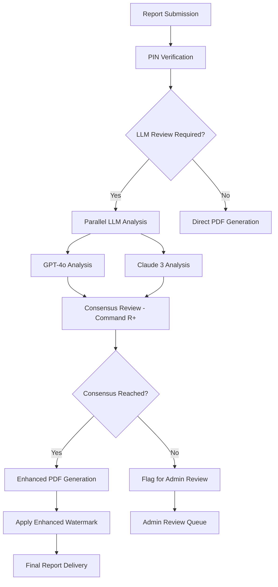

# VeriVault Multi-LLM Review Pipeline
## Future Phase Implementation Plan

> **Status**: 📋 Not yet implemented - Planning and documentation phase  
> **Priority**: Future enhancement after MVP  
> **Target**: Post-MVP enterprise features

---

## 🎯 Overview

The Multi-LLM Review Pipeline is a planned enhancement to VeriVault's report generation system that will use multiple AI models to analyze, verify, and improve security reports before final submission.

### Core Concept

Instead of relying on a single AI model, this pipeline will orchestrate multiple Large Language Models (LLMs) to provide comprehensive analysis and consensus-based report enhancement:

1. **GPT-4o**: Primary analysis for accuracy, completeness, and compliance
2. **Claude 3**: Independent analysis focusing on security implications and clarity
3. **Command R+**: Consensus review, discrepancy resolution, and final version generation

---

## 🏗️ Planned Architecture



---

## 🔧 Implementation Status

### ✅ Completed (MVP)
- PIN authentication system
- Basic watermarking infrastructure
- Report submission workflow
- PDF generation pipeline

### 📋 Planned Components

#### Backend Services
- [ ] **LLM Review Service** (`/server/src/services/llmReviewService.ts`)
  - Orchestrates multi-LLM analysis
  - Manages API connections to GPT-4o, Claude 3, Command R+
  - Handles confidence scoring and consensus building

- [ ] **Enhanced Report API** (`/server/src/routes/reports.ts`)
  - Extended with LLM review endpoints
  - Progress tracking for LLM analysis phases
  - Admin review flagging system

#### Frontend Components
- [ ] **LLM Review Progress Modal**
  - Real-time progress tracking
  - Phase indicators: "GPT-4o analyzing..." → "Claude 3 analyzing..." → "Consensus review..."
  - Estimated completion times

- [ ] **LLM Results Display**
  - Confidence scores from each model
  - Discrepancy highlights
  - Option to proceed or request human review

#### Enhanced PDF Generation
- [ ] **LLM Consensus Integration**
  - Include AI review summaries in reports
  - Display confidence scores
  - Show applied improvements

- [ ] **Advanced Watermarking**
  - Include LLM review hashes
  - Consensus metadata
  - Enhanced admin verification data

---

## 📊 Planned Workflow

### Phase 1: Parallel Analysis
```typescript
// TODO: Implement parallel LLM analysis
const [gpt4Analysis, claudeAnalysis] = await Promise.all([
  analyzeWithGPT4(reportData, reportType),
  analyzeWithClaude(reportData, reportType)
]);
```

### Phase 2: Consensus Review
```typescript
// TODO: Implement consensus algorithm
const consensusReview = await performConsensusReview(
  reportData, 
  gpt4Analysis, 
  claudeAnalysis
);
```

### Phase 3: Quality Assessment
```typescript
// TODO: Implement confidence scoring
if (consensusReview.overallConfidence < 0.7) {
  await flagForAdminReview(submissionId, consensusReview.concerns);
}
```

---

## 🎛️ Configuration Options

### Review Requirements
```typescript
REVIEW_REQUIREMENTS: {
  INCIDENT_REPORTS: true,   // Always review incident reports
  DAILY_LOGS: false,        // Skip daily logs unless flagged
  MEDICAL_REPORTS: true,    // Always review medical reports
  AUDIT_REPORTS: true       // Always review audit reports
}
```

### Confidence Thresholds
```typescript
CONFIDENCE_THRESHOLDS: {
  MIN_OVERALL: 0.7,        // Minimum overall confidence to proceed
  MIN_INDIVIDUAL: 0.6,     // Minimum individual LLM confidence
  DISCREPANCY_LIMIT: 3     // Max discrepancies before flagging
}
```

---

## 🔒 Security Considerations

### Data Privacy
- **API Key Security**: Secure storage and rotation of LLM API keys
- **Data Transmission**: Encrypted communication with external LLM services
- **Data Retention**: Configurable retention policies for LLM analysis data

### Reliability
- **Timeout Handling**: 2-minute total timeout with per-LLM limits
- **Fallback Mechanisms**: Graceful degradation when LLM services unavailable
- **Rate Limiting**: Prevent API quota exhaustion

### Audit Trail
- **LLM Interaction Logging**: Complete audit trail of all LLM requests/responses
- **Version Tracking**: Track which LLM models/versions were used
- **Consensus History**: Maintain record of discrepancies and resolutions

---

## 📈 Expected Benefits

### Quality Improvements
- **Higher Accuracy**: Multi-model verification reduces errors
- **Enhanced Clarity**: AI-driven clarity and readability improvements
- **Compliance Checking**: Automated compliance verification

### Operational Efficiency
- **Reduced Manual Review**: Automated quality assurance
- **Faster Turnaround**: Parallel processing for quick analysis
- **Consistent Standards**: Standardized report quality across all submissions

### Risk Mitigation
- **Error Detection**: Multiple models catch different types of issues
- **Bias Reduction**: Consensus approach reduces individual model biases
- **Human Oversight**: Automatic flagging ensures human review when needed

---

## 🚀 Implementation Roadmap

### Phase 1: Foundation (2-3 weeks)
1. Set up LLM API clients (OpenAI, Anthropic, Cohere) and authentication
2. Design and test prompt templates for GPT-4o, Claude 3, and Command R+
3. Implement basic parallel processing framework
4. Create confidence scoring algorithms

### Phase 2: Core Pipeline (3-4 weeks)
1. Build consensus review algorithm
2. Implement admin flagging system
3. Add progress tracking and status endpoints
4. Create timeout and error handling

### Phase 3: Integration (2-3 weeks)
1. Integrate with existing PIN/watermark system
2. Update frontend with LLM review components
3. Enhanced PDF generation with LLM metadata
4. Admin dashboard for flagged reports

### Phase 4: Testing & Optimization (2-3 weeks)
1. Comprehensive testing with various report types
2. Performance optimization and caching
3. Security audit and penetration testing
4. Documentation and training materials

---

## 💡 Technical Notes

### LLM Model Selection
- **GPT-4o**: Chosen for comprehensive analysis capabilities
- **Claude 3**: Selected for security-focused analysis
- **Command R+**: Preferred for consensus due to strong reasoning capabilities and enterprise features

### Performance Considerations
- **Parallel Processing**: GPT-4o and Claude 3 run simultaneously
- **Caching**: Cache common analysis patterns to reduce API calls
- **Progressive Enhancement**: System works without LLM review if services unavailable

### Integration Points
- **PIN Confirmation Flow**: Extended to show LLM review progress
- **Watermarking System**: Enhanced with LLM consensus hashes
- **Admin Dashboard**: New section for reviewing flagged reports

---

## 📝 Current Implementation Markers

Throughout the codebase, look for these TODO markers to find LLM pipeline integration points:

```typescript
// TODO: FUTURE PHASE - Multi-LLM Review Pipeline
// TODO: Build LLM consensus layer for report verification
// TODO: Add LLM review metadata when implemented
// TODO: Future - Add AI-REVIEWED badge
```

### Key Files with LLM TODOs
- `server/src/routes/reports.ts` - Main pipeline integration
- `server/src/services/llmReviewService.ts` - Service implementation
- `client/src/components/Dashboard.tsx` - Frontend integration
- `client/src/components/PinConfirmationModal.tsx` - User experience

---

## 🎯 Success Metrics

### Quality Metrics
- Report accuracy improvement: Target 15-20% reduction in errors
- Clarity score improvement: Target average clarity rating > 8.5/10
- Compliance coverage: Target 99%+ compliance verification

### Operational Metrics
- Processing time: Target < 2 minutes for standard reports
- False positive rate: Target < 5% of reports flagged unnecessarily
- User satisfaction: Target > 90% user approval rating

### Technical Metrics
- System availability: Target 99.9% uptime
- API response time: Target < 30 seconds per LLM
- Cost efficiency: Target < $0.50 per report analysis

---

*This document serves as the master planning document for the Multi-LLM Review Pipeline feature. It will be updated as implementation progresses and requirements evolve.* 